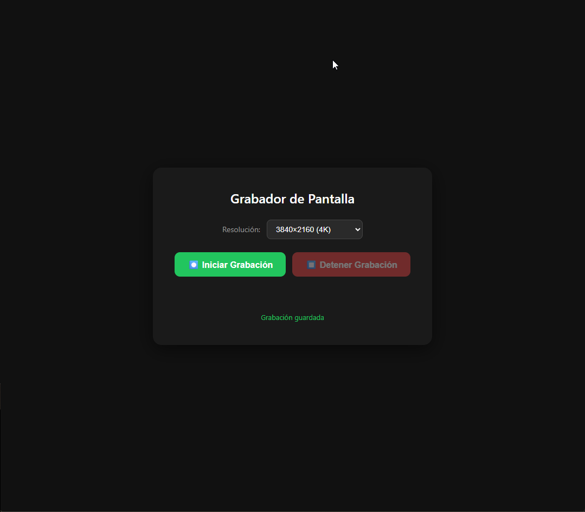

# Screen Recorder

## Problema

Grabar la pantalla del navegador nativamente suele requerir software externo, carece de control sobre la resolución de captura o no ofrece feedback visual del estado de grabación. Las herramientas existentes muchas veces son pesadas, de pago o no permiten elegir calidad.

## Solución

App web liviana que usa las APIs modernas del navegador (`getDisplayMedia` + `MediaRecorder`) para capturar pantalla con resolución configurable, botón de detener y timer en vivo. Sin instalación, sin dependencias, solo HTML/CSS/JS.

## Vista previa

## Cómo funciona

1. El usuario selecciona una resolución (SD a 4K) en el dropdown.
2. Hace click en **Iniciar Grabación** → el navegador abre el diálogo nativo para elegir pantalla, ventana o pestaña.
3. La resolución elegida se pasa como constraint de video a `getDisplayMedia({ video: { width, height } })`.
4. `MediaRecorder` codifica los frames entrantes en formato WebM con codec VP8 + Opus, segmentando cada 1 segundo.
5. El usuario puede presionar **Detener Grabación** o cerrar el diálogo nativo de compartir pantalla — en ambos casos se descarga automáticamente el archivo `.webm`.
6. Un timer en vivo muestra la duración exacta mientras se graba.

## Características

- 5 resoluciones disponibles: 640×480 (SD), 1280×720 (HD), 1920×1080 (Full HD), 2560×1440 (2K), 3840×2160 (4K)
- Botón Start/Stop con estados deshabilitados según el contexto
- Timer e indicador animado de grabación (punto rojo pulsante)
- Feedback de errores: cancelación del diálogo, permisos denegados, fallos de captura
- Selector de resolución deshabilitado durante la grabación
- Tema oscuro con diseño de tarjeta centrada

## Uso

Abrí `index.html` en un navegador compatible (Chrome, Edge, Firefox) y hace click en **Iniciar Grabación**.
